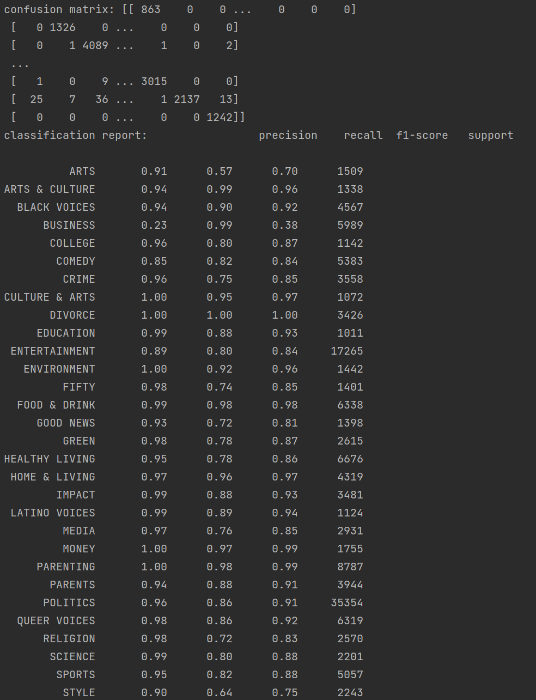
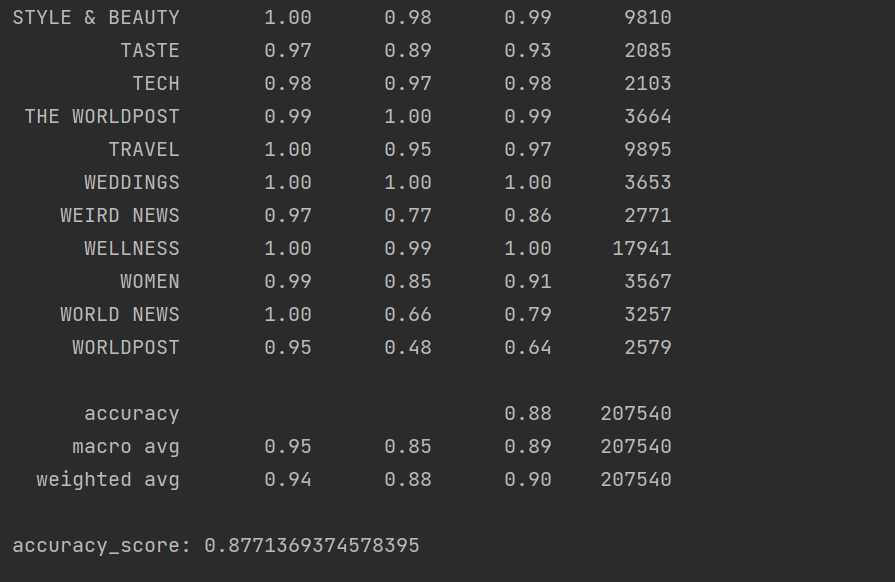

# bda-classifyNews

### predict.py 是用已经保存好的模型来预测类别

#### 提供了两个函数接口
''' 
    
    def predict_json(pathToJson):
        df = load_test_set(pathToJson)
        df['short_description'] = df.short_description.apply(process_text)
        df['short_description'] = df.short_description.apply(join_word)
        model, vec = joblib.load('knn_model.joblib')
    
        feature = vec.transform(df['short_description'])
    
        prediction = model.predict(feature)
    
        print('confusion matrix:', confusion_matrix(df['category'], prediction))
    
        print('classification report:', classification_report(df['category'], prediction))
    
        print('accuracy_score:', accuracy_score(df['category'], prediction))
'''

    def predict(headline, authors, link, des, date):
        model, vec = joblib.load('knn_model.joblib')
        feature = vec.transform([des])
        prediction = model.predict(feature)
        print(prediction[0])

## Recommended IDE Setup

### Anaconda + Pycharm


## configuration

### python 3.6 


## Project Setup

```sh
conda create --name bda python=3.6
```

```sh
conda activate bda
```

```sh
pip install requirement.txt
```


